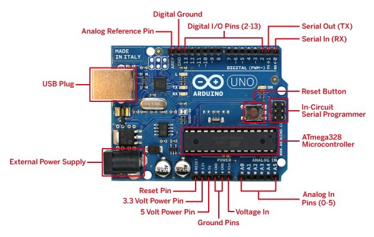
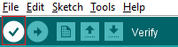
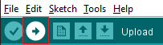
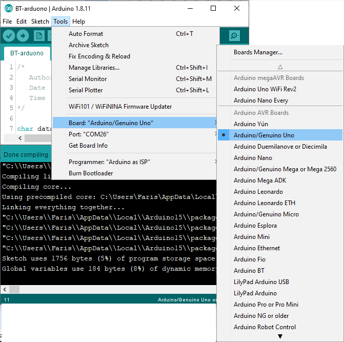
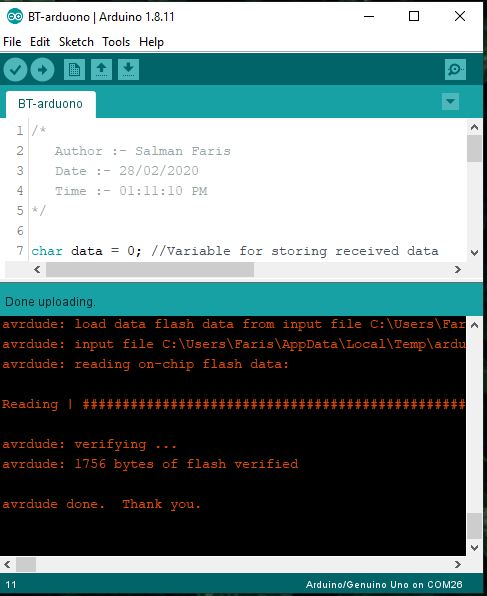

# Arduino Basic

**Arduino** is an open-source electronics platform based on easy-to-use hardware and software. Arduino boards are able to read inputs - light on a sensor, a finger on a button, or a Twitter message - and turn it into an output - activating a motor, turning on an LED, publishing something online. You can tell your board what to do by sending a set of instructions to the microcontroller on the board. To do so you use the Arduino programming language (based on Wiring), and the Arduino Software (IDE), based on Processing.

Over the years Arduino has been the brain of thousands of projects, from everyday objects to complex scientific instruments. A worldwide community of makers - students, hobbyists, artists, programmers, and professionals - has gathered around this open-source platform, their contributions have added up to an incredible amount of accessible knowledge that can be of great help to novices and experts alike.

Arduino was born at the Ivrea Interaction Design Institute as an easy tool for fast prototyping, aimed at students without a background in electronics and programming. As soon as it reached a wider community, the Arduino board started changing to adapt to new needs and challenges, differentiating its offer from simple 8-bit boards to products for IoT applications, wearable, 3D printing, and embedded environments. All Arduino boards are completely open-source, empowering users to build them independently and eventually adapt them to their particular needs. The software, too, is open-source, and it is growing through the contributions of users worldwide.

## Why Arduino?
Thanks to its simple and accessible user experience, Arduino has been used in thousands of different projects and applications. The Arduino software is easy-to-use for beginners, yet flexible enough for advanced users. It runs on Mac, Windows, and Linux. Teachers and students use it to build low cost scientific instruments, to prove chemistry and physics principles, or to get started with programming and robotics. Designers and architects build interactive prototypes, musicians and artists use it for installations and to experiment with new musical instruments. Makers, of course, use it to build many of the projects exhibited at the Maker Faire, for example. Arduino is a key tool to learn new things. Anyone - children, hobbyists, artists, programmers - can start tinkering just following the step by step instructions of a kit, or sharing ideas online with other members of the Arduino community.

There are many other microcontrollers and microcontroller platforms available for physical computing. Parallax Basic Stamp, Netmedia's BX-24, Phidgets, MIT's Handyboard, and many others offer similar functionality. All of these tools take the messy details of microcontroller programming and wrap it up in an easy-to-use package. Arduino also simplifies the process of working with microcontrollers, but it offers some advantage for teachers, students, and interested amateurs over other systems:

* **Inexpensive** - Arduino boards are relatively inexpensive compared to other microcontroller platforms. The least expensive version of the Arduino module can be assembled by hand, and even the pre-assembled Arduino modules cost less than $50

* **Cross-platform** - The Arduino Software (IDE) runs on Windows, Macintosh OSX, and Linux operating systems. Most microcontroller systems are limited to Windows.
Simple, clear programming environment - The Arduino Software (IDE) is easy-to-use for beginners, yet flexible enough for advanced users to take advantage of as well. For teachers, it's conveniently based on the Processing programming environment, so students learning to program in that environment will be familiar with how the Arduino IDE works.

* **Open source and extensible software** - The Arduino software is published as open source tools, available for extension by experienced programmers. The language can be expanded through C++ libraries, and people wanting to understand the technical details can make the leap from Arduino to the AVR C programming language on which it's based. Similarly, you can add AVR-C code directly into your Arduino programs if you want to.

* **Open source and extensible hardware** - The plans of the Arduino boards are published under a Creative Commons license, so experienced circuit designers can make their own version of the module, extending it and improving it. Even relatively inexperienced users can build the breadboard version of the module in order to understand how it works and save money.

## Arduino Uno

**Arduino Uno** is a microcontroller board based on the ATmega328P (datasheet). It has **14 digital input/output** pins (of which 6 can be used as PWM outputs), **6 analog inputs** , a 16 MHz ceramic resonator, a USB connection, a power jack, an ICSP header and a reset button.

**"Uno"** means one in Italian and was chosen to mark the release of Arduino Software (IDE) 1.0.

## Arduino Software (IDE)

The Arduino Integrated Development Environment - or Arduino Software (IDE) - contains a text editor for writing code, a message area, a text console, a toolbar with buttons for common functions and a series of menus. It connects to the **Arduino and Genuino hardware** to upload programs and communicate with them.

### Writing Sketches

Programs written using Arduino Software (IDE) are called sketches. These sketches are written in the text editor and are saved with the file extension .ino. The editor has features for cutting/pasting and for searching/replacing text. The message area gives feedback while saving and exporting and also displays errors. The console displays text output by the Arduino Software (IDE), including complete error messages and other information. The bottom righthand corner of the window displays the configured board and serial port. The toolbar buttons allow you to verify and upload programs, create, open, and save sketches, and open the serial monitor.

### Writing Hello World Sketches

Here we we are writing a blink sketch , that will **Trun ON** and **Turn OFF** an LED.

#### Code

<pre>
void Setup()
{
 &nbsp;pinMode(13, OUTPUT);
}
void loop()
{
 &nbsp;digitalWrite(13, HIGH);
 &nbsp;delay(1000);
 &nbsp;digitalWrite(13, LOW);
 &nbsp;delay(1000);
}

</pre>

* `Setup()`:   The setup() function is called when a sketch starts. Use it to initialize variables, pin modes, start using libraries, etc. The setup() function will only run once, after each powerup or reset of the Arduino board.

* `pinMode(13,OUTPUT)` :- Configures the specified pin to behave either as an input or an output. See the Digital Pins page for details on the functionality of the pins. 

**Syntax** `pinMode(pin, mode)` :-  **pin** : the Arduino pin number to set the mode of, **mode** :  INPUT, OUTPUT, or INPUT_PULLUP. 

* `void loop()` :- After creating a **setup()** function, which initializes and sets the initial values, the **loop()** function does precisely what its name suggests, and loops consecutively, allowing your program to change and respond. Use it to actively control the Arduino board.

* `digitalWrite(13,HIGH);` :- Write a HIGH value to a digital pin. 

* `digitalWrite(13,LOW);` :- Write LOW value to a digital pin. 

**Syntax** `digitalWrite(pin, value)` , **Parameters** `pin` : the Arduino pin number. `value` : HIGH or LOW.

#### Compile the code 

You can Compile and verify your code by clicking the **Verify** button on Arduino IDE, this process will check syntax errors. 

after successful compilation you can see **Done Compiling**

#### Upload the code into Arduino uno 

After successful compilation we can upload the code into Arduino Uno Devlopment board. for that we need click ***Upload* button.

before upaloading we need to select the devlopment board from the from Arduino IDE **Tools -> Board**  and **Port** from Arduino IDE **Tools -> Port**. 

 
  

here I selected **Arduino Uno** as board and **COM26** as **Port**. 

Then click **Upload**

#### Test

onnect the **LED Postive** pin on **Arduino Pin 13** and **Negative Pin** on **Arduino Grond (GND)**

You can see the LED Blinking. 

#### Conclusion

Arduino is very powerfull and easy tool, it can increse your prototyping process fast and quickly with availble Add-ons.

If you want to learn more! , check out these. 

## Available Project Documentations.

1. [Control Things using Mobile Phone](Control-Things-Using-Mobile-Phone/control-things-using-phone.md) (beginner)
2. [Control things using Voice](Control-Things-Using-Voice/control-things-using-voice.md) (intermediate)
3. [Digital Thermostat](Digital-Thermostat/digital-thermostat.md) (beginner)
4. [Digital Scale](Digital-Scale/digital-scale.md) (beginner)

