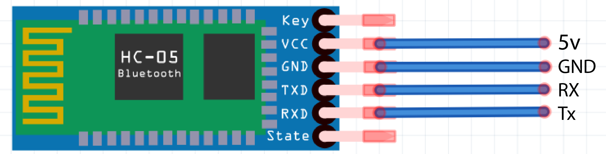

# Control Things Using Mobile

In this workhop we will learn how to control things using a mobile app with arduino and bluetooth module .

### Problem Statement 

We need to get up and walk into the switch board everytime to turn on and off the light or fan etc. 

### Idea

What if, we have a system that can be contol the light and fan using our mobile phone.

### Solution

Build a device that can be controled with mobile app , so we can use the device to trigger the actions on home appliance .

### Prototype Building

* Build a device that can be control with Android Application 

Using Arduino and Andoird App we can make the idea into a relaity, since the Arduino can turn on and off using programming also it can be attached with bluetooth module, so we can build a mobile app that can be communicate with arduino.

### Things we need

1. Arduino Uno
2. HC-05 Bluetooth Module
3. Led's
3. Jumber Wires
4. Breadboard

### Step 1: Arduino Setup

#### 1.1: Install Arduino IDE 

Download the [Arduino IDE](https://www.arduino.cc/en/Main/Software) and install it on your computer.

#### 1.2 walk-through the Arduino Introduction page to learn basics
If you are new to the arduino system, you can learn the [ Arduino basics from here](Arduino-basics/arduino-basics.md) , after reading then go to the next step. 

### Step 2: Coding

#### 2.1 Algorithm

#### 2.2 Open Arduino IDE and Start a new Sketch 

#### 2.3 Copy and Paste the Code

<pre>
char data = 0; &#47;&#47;Variable for storing received data

void setup()
{
 &nbsp;<b>Serial</b>.begin(9600); &nbsp;&nbsp;&nbsp;&nbsp;&nbsp;&nbsp;&nbsp;&nbsp;&#47;&#47;Sets the data rate in bits per second (baud) for serial data transmission
 &nbsp;pinMode(13, OUTPUT); &nbsp;&nbsp;&nbsp;&nbsp;&nbsp;&nbsp;&nbsp;&#47;&#47;Sets digital pin 13 as output pin

}
void loop()
{
 &nbsp;if (<b>Serial</b>.available() &gt; 0) &#47;&#47; Send data only when you receive data:
 &nbsp;{
 &nbsp;&nbsp;&nbsp;data = <b>Serial</b>.read(); &nbsp;&nbsp;&nbsp;&nbsp;&nbsp;&#47;&#47;Read the incoming data and store it into variable data
 &nbsp;&nbsp;&nbsp;if (data == &#39;A&#39;) &nbsp;&nbsp;&nbsp;&nbsp;&nbsp;&nbsp;&nbsp;&nbsp;&nbsp;&nbsp;&#47;&#47;Checks whether value of data is equal to &#34;A&#34;
 &nbsp;&nbsp;&nbsp;&nbsp;&nbsp;digitalWrite(13, HIGH); &nbsp;&#47;&#47;If value is &#34;A&#34; then LED turns ON
 &nbsp;&nbsp;&nbsp;else if (data == &#39;B&#39;) &nbsp;&nbsp;&nbsp;&nbsp;&nbsp;&#47;&#47;Checks whether value of data is equal to &#34;B&#34;
 &nbsp;&nbsp;&nbsp;&nbsp;&nbsp;digitalWrite(13, LOW); &nbsp;&nbsp;&#47;&#47;If value is &#34;B&#34; then LED turns OFF
 &nbsp;}
}

</pre>

#### 2.4 Code Overview

* `char data = 0;` :- **data** is **char** data type and it used to hold the incoming data from Android Application that receved vis bluetooth interface. 

* `void setup()` :- The **setup()** function is called when a sketch starts. Use it to initialize variables, pin modes, start using libraries, etc. The **setup()** function will only run once, after each powerup or reset of the Arduino board.

* `Serial.begin(9600);` :- Sets the data rate in bits per second (baud) for serial data transmission , 

Syntax `Serial.begin(speed);` here we used speed as 9600bps. 

* `pinMode(13,OUTPUT)` :- Configures the specified pin to behave either as an input or an output. See the Digital Pins page for details on the functionality of the pins.

**Syntax** `pinMode(pin, mode)` :-  **pin** : the Arduino pin number to set the mode of, **mode** :  INPUT, OUTPUT, or INPUT_PULLUP. 

* `void loop()` :- After creating a **setup()** function, which initializes and sets the initial values, the **loop()** function does precisely what its name suggests, and loops consecutively, allowing your program to change and respond. Use it to actively control the Arduino board.

* `Serial.available()` :-  Get the number of bytes (characters) available for reading from the serial port, it used to reply only when we receive data.

* `data = Serial.read();` :- Reads incoming serial data and store into the **data** varible that we declare in the first place. 

* `if` and `else` :- The if statement checks for a condition and executes the proceeding statement or set of statements if the condition is 'true'.

* The if…​else allows greater control over the flow of code than the basic if statement, by allowing multiple tests to be grouped. An else clause (if at all exists) will be executed if the condition in the if statement results in false. The else can proceed another if test, so that multiple, mutually exclusive tests can be run at the same time.

* `digitalWrite(13,HIGH);` :- Write a HIGH value to a digital pin. 

* `digitalWrite(13,LOW);` :- Write LOW value to a digital pin. 

**Syntax** `digitalWrite(pin, value)` , **Parameters** `pin` : the Arduino pin number. `value` : HIGH or LOW.

#### 2.5 Compile the code 

You can Compile and verify your code by clicking the **Verify** button on Arduino IDE, this process will check syntax errors. 

after successful compilation you can see **Done Compiling**

#### 2.5 Upload the code into Arduino uno 

After successful compilation we can upload the code into Arduino Uno Devlopment board. for that we need click ***Upload* button.

before upaloading we need to select the devlopment board from the from Arduino IDE **Tools -> Board**  and **Port** from Arduino IDE **Tools -> Port**. 

 
  

here I selected **Arduino Uno** as board and **COM26** as **Port**. 

Then click **Upload**

### Step 3: Testing

We can test the project from halfway without bluetooth module by using **Serial Monitor** . 

#### 3.1 Connect LED 

Connect the **LED Postive** pin on **Arduino Pin 13** and **Negative Pin** on **Arduino Grond (GND)**

After connecting the LED connect the USB cable and Open **Serial Monitor** .

Open the **Serial Monitor**  and try enter **A** or **B** and press enter or click **send** button. 

You can see logic in action.

### Step 4: Building Android Application

To build Mobile application we are using **[MIT APP INVENTOR](https://appinventor.mit.edu/)**, MIT App Inventor for Android is an open-source web application originally provided by Google, and now maintained by the Massachusetts Institute of Technology (MIT).App Inventor lets you develop applications for Android phones using a web browser and either a connected phone or emulator.

Open **[MIT APP INVENTOR](https://appinventor.mit.edu/)** and Login , and Click **[Creat Apps](http://ai2.appinventor.mit.edu/)** to start the devlopment.

#### Flow chart 

App inventor have two part

1. The App Inventor Designer, where you select the components for your app.
2. The App Inventor Blocks Editor, where you assemble program blocks that specify how the components should behave. You assemble programs visually, fitting pieces together like pieces of a puzzle.

Here we are going to control LED light by using our phone , for this we need an Application so we are using MIT App inventor.

#### 4.1 UI Devlopment 

The App Inventor Components are located on the left hand side of the Designer Window under the title Palette. Components are the basic elements you use to make apps on the Android phone. They're like the ingredients in a recipe. Some components are very simple, like a Label component, which just shows text on the screen, or a Button component that you tap to initiate an action.

We need add two Buttons For **Turn ON** and **Turn OFF** the LED , and One **Listpicker** for selecting the bluetooth device. also we need to add the Bluetooth Client it avilable under the Connectivity tab.

Here is Simple design if the Application User Interface.you can see the components list that we used in the app in right side.

#### 4.2 Adding App Logic

Actually we don't need any coding to do our app , we just need to arrange some logic blocks in a order . to get into logic you need to click the **block** button on the right corner . 

we have main two code blocks. 

1. **Bluetooth selection** 
: we are using **ListPicker** for the bluetooth selection.

ListPicker have two state , one is BeforePicking state,in here we are loading bluetooth names in the list, second is AfterPicking here we are connecting the Bluetooth device that loaded on the ListPicker BeforePicking state , and also we are changing the text of the ListPicker in to Connected when we establish a bluetooth connection.

2. **Button Activity**  we are using two **buttons** for contorling LED state

when we click a button bluetooth will transmit a text to device that connectedw with phone(we alredy connected a bluetooth device using ListPicker Bluetooth Selection). here if we press the Button2 it will transmit letter **'A'** and if we press the Button3 it will transmit letter **'B'** ,that's all.

#### 4.3 Download the application 

We need to install applicaion on our mobile phone , **.apk** file can be download by clicking Build button on the top navigavtion panel.

Building Apk will take less than one minute time.

Download the .apk file and install it on your android phone.next upload bluetooth progarmme to your board and connect with bluetooth module.

### Setp 5: Interfacing Arduino with Bluetooth Module. 

Next we need to connect the Arduino into Bluetooth module.here we are using **HC-05** It is based on **Bluetooth SPP** (Serial Port Protocol) module,designed for transparent wireless serial connection setup.he HC-05 Bluetooth Module can be used in a Master or Slave configuration.This serial port bluetooth module is fully qualified Bluetooth V2.0+EDR (Enhanced Data Rate) 3Mbps Modulation with complete 2.4GHz radio transceiver and baseband. It uses CSR Bluecore 04‐External single chip Rluetooth system with CMOS technology and with AFH (Adaptive Frequency Hopping Feature).datasheet :- https://www.gme.cz/data/attachments/dsh.772-148.1.pdf

#### 5:1 Pin Description

The HC-05 Bluetooth Module has 6pins. They are as follows:

* ENABLE: When enable is pulled LOW, the module is disabled which means the module will not turn on and it fails to communicate.When enable is left open or connected to 3.3V, the module is enabled i.e the module remains on and communication also takes place.

* Vcc: Supply Voltage 3.3V to 5V

* GND: Ground Pin

* TXD & RXD: These two pins acts as an UART interface for communication

* STATE: It acts as a status indicator.When the module is not connected to / paired with any other bluetooth device,signal goes Low.At this low state,the led flashes continuously which denotes that the module is not paired with other device.When this module is connected to/paired with any other bluetooth device,the signal goes High. At this high state,the led blinks with a constant delay say for example 2s delay which indicates that the module is paired.

* BUTTON SWITCH: This is used to switch the module into AT command mode. To enable AT command mode,press the button switch for a second. With the help of AT commands,the user can change the parameters of this module but only when the module is not paired with any other BT device.If the module is connected to any other bluetooth device, it starts to communicate with that device and fails to work in AT command mode.

#### 5:2 Connection Diagram

Connect the arduino on hc-05 bluetooth module with jumbers or breadboard.

#### Demo

* Connect arduino and bluetooth Module
* Open android app 
* Connect bluetooth with app

#### ToDO

- [ ] Add more led's Arduino and Add more button on the Application.

- [ ] Try Relay module and control the AC Signal 

- [ ] Read sensor data from Arduino to Mobile Application

### Thank You, Hope you enjoyed!

Please share your feedback.
