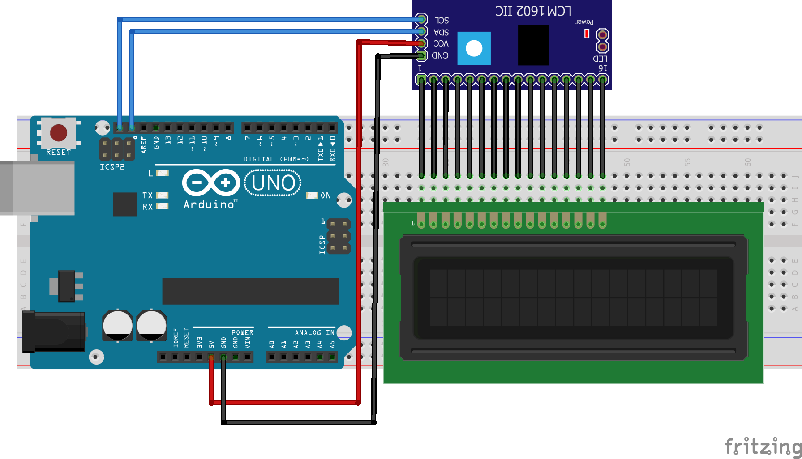

# Digital Clock

In this workhop we will learn how to how to make a digital clock using arduino and RTC module. 

### Objective 

Build a digitalClock using arduino and RTC module, that will keep the time even arduino is turne off . 

### Prototype Building

Here we are using an Arduino as controller and DS323 Real Time Clock module to Count and keep the time and 16x2 LCD Display to Display the Time and Date. 

### Things we need 

1. Arduino Uno
2. Real Time Clock Module
3. 16x2 LCD Module
4. 10k ohm potentiometer
5. 220 ohm resistor
6. Jumper Wires
7. Breadboard

#### DS3231 Real Time Clock

The **DS3231** is a low-cost, highly accurate Real Time Clock which can maintain hours, minutes and seconds, as well as, day, month and year information. Also, it has automatic compensation for leap-years and for months with fewer than 31 days.

The module can work on either 3.3 or 5 V which makes it suitable for many development platforms or microcontrollers. The battery input is 3V and a typical CR2032 3V battery can power the module and maintain the information for more than a year.

The module uses the I2C Communication Protocol which makes the connection to the Arduino Board very easy.

#### LCD Module
An LCD is an electronic display module which uses liquid crystal to produce a visible image. The 16×2 LCD display is a very basic module commonly used in DIYs and circuits. The 16×2 translates o a display 16 characters per line in 2 such lines. In this LCD each character is displayed in a 5×7 pixel matrix.

#### Pin Description 

### Step 1: Arduino Setup

#### 1.1: Install Arduino IDE

Download the [Arduino IDE](https://www.arduino.cc/en/Main/Software) and install it on your computer.

#### 1.2 walk-through the Arduino Introduction page to learn basics
If you are new to the arduino system, you can learn the [ Arduino basics from here](Arduino-basics/arduino-basics.md) , after reading then go to the next step.

### Step 2: Programming

#### 2.1 Algorithm

#### 2.2 Open Arduino IDE and Start a new Sketch 

#### 2.3 Read then Copy and Paste the Code

#### Testing the RTC Module.

To test the RTC you need to downlaod two Arduino Library.

* [DS1307RTC Library](https://github.com/PaulStoffregen/DS1307RTC): [click here to download](https://github.com/PaulStoffregen/DS1307RTC/archive/master.zip)

* [Time Library](https://github.com/PaulStoffregen/Time): [click here to download](https://github.com/PaulStoffregen/Time/archive/master.zip)

after downlaoding we need to add the libraries into arduino ide. for that open Libraray manager by clicking **Sketch -> Include Library -> Add .ZIP Library**

Click the **Add .ZIP Library** 

#### SetTime

First we need to set the RTC Module Time, for that insert Coin (CR2032) Cell battery on RTC Module and Connct with Arduino Uno.

#### Upload Sktech 

<pre>
#include &lt;Wire.h&gt;
#include &lt;TimeLib.h&gt;
#include &lt;DS1307RTC.h&gt;

const char *monthName[12] = {
 &nbsp;&#34;Jan&#34;, &#34;Feb&#34;, &#34;Mar&#34;, &#34;Apr&#34;, &#34;May&#34;, &#34;Jun&#34;,
 &nbsp;&#34;Jul&#34;, &#34;Aug&#34;, &#34;Sep&#34;, &#34;Oct&#34;, &#34;Nov&#34;, &#34;Dec&#34;
};

tmElements_t tm;

void setup() {
 &nbsp;bool parse=false;
 &nbsp;bool config=false;

 &nbsp;&#47;&#47; get the date and time the compiler was run
 &nbsp;if (getDate(__DATE__) &amp;&amp; getTime(__TIME__)) {
 &nbsp;&nbsp;&nbsp;parse = true;
 &nbsp;&nbsp;&nbsp;&#47;&#47; and configure the RTC with this info
 &nbsp;&nbsp;&nbsp;if (RTC.write(tm)) {
 &nbsp;&nbsp;&nbsp;&nbsp;&nbsp;config = true;
 &nbsp;&nbsp;&nbsp;}
 &nbsp;}

 &nbsp;<b>Serial</b>.begin(9600);
 &nbsp;while (!<b>Serial</b>) ; &#47;&#47; wait for Arduino Serial Monitor
 &nbsp;delay(200);
 &nbsp;if (parse &amp;&amp; config) {
 &nbsp;&nbsp;&nbsp;<b>Serial</b>.print(&#34;DS1307 configured Time=&#34;);
 &nbsp;&nbsp;&nbsp;<b>Serial</b>.print(__TIME__);
 &nbsp;&nbsp;&nbsp;<b>Serial</b>.print(&#34;, Date=&#34;);
 &nbsp;&nbsp;&nbsp;<b>Serial</b>.println(__DATE__);
 &nbsp;} else if (parse) {
 &nbsp;&nbsp;&nbsp;<b>Serial</b>.println(&#34;DS1307 Communication Error :-{&#34;);
 &nbsp;&nbsp;&nbsp;<b>Serial</b>.println(&#34;Please check your circuitry&#34;);
 &nbsp;} else {
 &nbsp;&nbsp;&nbsp;<b>Serial</b>.print(&#34;Could not parse info from the compiler, Time=\&#34;&#34;);
 &nbsp;&nbsp;&nbsp;<b>Serial</b>.print(__TIME__);
 &nbsp;&nbsp;&nbsp;<b>Serial</b>.print(&#34;\&#34;, Date=\&#34;&#34;);
 &nbsp;&nbsp;&nbsp;<b>Serial</b>.print(__DATE__);
 &nbsp;&nbsp;&nbsp;<b>Serial</b>.println(&#34;\&#34;&#34;);
 &nbsp;}
}

void loop() {
}

bool getTime(const char *str)
{
 &nbsp;int Hour, Min, Sec;

 &nbsp;if (sscanf(str, &#34;%d:%d:%d&#34;, &amp;Hour, &amp;Min, &amp;Sec) != 3) return false;
 &nbsp;tm.Hour = Hour;
 &nbsp;tm.Minute = Min;
 &nbsp;tm.Second = Sec;
 &nbsp;return true;
}

bool getDate(const char *str)
{
 &nbsp;char Month[12];
 &nbsp;int Day, Year;
 &nbsp;uint8_t monthIndex;

 &nbsp;if (sscanf(str, &#34;%s %d %d&#34;, Month, &amp;Day, &amp;Year) != 3) return false;
 &nbsp;for (monthIndex = 0; monthIndex &lt; 12; monthIndex++) {
 &nbsp;&nbsp;&nbsp;if (strcmp(Month, monthName[monthIndex]) == 0) break;
 &nbsp;}
 &nbsp;if (monthIndex &gt;= 12) return false;
 &nbsp;tm.Day = Day;
 &nbsp;tm.Month = monthIndex + 1;
 &nbsp;tm.Year = CalendarYrToTm(Year);
 &nbsp;return true;
}

</pre>

Upload the sktech and open the Serial Monitor and it will shows like this

``DS1307 configured Time=11:24:26, Date=Mar 10 2020``

That means our RTC module is set with the time.

### Tesing LCD Module

Here we are using LCD Module with **12C addons** for I2C Communication , which will only need two wires for communication, in other way we need to use 14 pins. 

Since the I2C is a addon we need  to insert the library on Arduino IDE first. For that first downlaod the [Arduino-LiquidCrystal-I2C-library.zip](src/lib/Arduino-LiquidCrystal-I2C-library.zip), Then click **Sketch -> Include Library -> Add .ZIP Library**

then select the **.Zip** file and click open.

now we successfully added the I2C library. 

#### Uplaod and Compaile Code 

<pre>
#include &lt;Wire.h&gt; 
#include &lt;<b>LiquidCrystal_I2C</b>.h&gt;

&#47;&#47; Set the LCD address to 0x27 for a 16 chars and 2 line display
<b>LiquidCrystal_I2C</b> <b>lcd</b>(0x27, 16, 2);

void setup()
{
&#09;&#47;&#47; initialize the LCD
&#09;<b>lcd</b>.begin();

&#09;&#47;&#47; Turn on the blacklight and print a message.
&#09;<b>lcd</b>.backlight();
&#09;<b>lcd</b>.print(&#34;Hello, world!&#34;);
}

void loop()
{
&#09;<b>lcd</b>.setCursor(0, 1);
 &nbsp;<b>lcd</b>.print(millis() &#47; 1000);
 &nbsp;
}

</pre>

#### Connect LCD Module with Arduino

 Demonstrates the use a 16x2 LCD display.  The I2C LiquidCrystal Module comes with 4-pins and connect them with follwing model.

 * LCD SCL - Arduino SCL
 * LCD SDA - Arduino SDA
 * LCD GND - Arduino GND
 * LCD VCC - Arduino VCC

 This sketch prints "Hello World!" to the LCD
 and shows the time.

 

### Step 3: Combine both RTC and LCD Module Sktech

We tested both and now we need to combine the both hardware and progrmmes into one.

### Pin Diagram.

Connect the RTC and I2C LCD module with the arduino using same VCC and GND also , we can use same SDA and SCL since I2C based on I2C 

#### Sketch.

<pre>
#include &lt;Wire.h&gt;
#include &lt;<b>LiquidCrystal_I2C</b>.h&gt;
#include &lt;TimeLib.h&gt;
#include &lt;DS1307RTC.h&gt;

&#47;&#47; Set the LCD address to 0x27 for a 16 chars and 2 line display
<b>LiquidCrystal_I2C</b> <b>lcd</b>(0x27, 16, 2);

void setup()
{
 &nbsp;&#47;&#47; initialize the LCD
 &nbsp;<b>lcd</b>.begin();
 &nbsp;<b>Serial</b>.begin(9600);
 &nbsp;&#47;&#47; Turn on the blacklight and print a message.
 &nbsp;<b>lcd</b>.backlight();

}

void loop()
{
 &nbsp;tmElements_t tm;
 &nbsp;if (RTC.read(tm)) {
 &nbsp;&nbsp;&nbsp;<b>lcd</b>.setCursor(0, 0);
 &nbsp;&nbsp;&nbsp;<b>lcd</b>.print(&#34;Time: &nbsp;&#34;);
 &nbsp;&nbsp;&nbsp;<b>lcd</b>.print(tm.Hour);
 &nbsp;&nbsp;&nbsp;<b>lcd</b>.write(&#39;:&#39;);
 &nbsp;&nbsp;&nbsp;<b>lcd</b>.print(tm.Minute);
 &nbsp;&nbsp;&nbsp;<b>lcd</b>.write(&#39;:&#39;);
 &nbsp;&nbsp;&nbsp;<b>lcd</b>.print(tm.Second);

 &nbsp;&nbsp;&nbsp;<b>Serial</b>.print(&#34;Time: &nbsp;&#34;);
 &nbsp;&nbsp;&nbsp;<b>Serial</b>.print(tm.Hour);
 &nbsp;&nbsp;&nbsp;<b>Serial</b>.write(&#39;:&#39;);
 &nbsp;&nbsp;&nbsp;<b>Serial</b>.print(tm.Minute);
 &nbsp;&nbsp;&nbsp;<b>Serial</b>.write(&#39;:&#39;);
 &nbsp;&nbsp;&nbsp;<b>Serial</b>.print(tm.Second);

 &nbsp;&nbsp;&nbsp;<b>lcd</b>.setCursor(0, 1);
 &nbsp;&nbsp;&nbsp;<b>lcd</b>.print(&#34;Date: &nbsp;&#34;);
 &nbsp;&nbsp;&nbsp;<b>lcd</b>.print(tm.Day);
 &nbsp;&nbsp;&nbsp;<b>lcd</b>.write(&#39;&#47;&#39;);
 &nbsp;&nbsp;&nbsp;<b>lcd</b>.print(tm.Month);
 &nbsp;&nbsp;&nbsp;<b>lcd</b>.write(&#39;&#47;&#39;);
 &nbsp;&nbsp;&nbsp;<b>lcd</b>.print(tmYearToCalendar(tm.Year));

 &nbsp;&nbsp;&nbsp;<b>Serial</b>.print(&#34;Ok, Time = &#34;);

 &nbsp;&nbsp;&nbsp;print2digits(tm.Hour);
 &nbsp;&nbsp;&nbsp;<b>Serial</b>.write(&#39;:&#39;);
 &nbsp;&nbsp;&nbsp;print2digits(tm.Minute);
 &nbsp;&nbsp;&nbsp;<b>Serial</b>.write(&#39;:&#39;);
 &nbsp;&nbsp;&nbsp;print2digits(tm.Second);
 &nbsp;&nbsp;&nbsp;<b>Serial</b>.print(&#34;, Date (D&#47;M&#47;Y) = &#34;);
 &nbsp;&nbsp;&nbsp;<b>Serial</b>.print(tm.Day);
 &nbsp;&nbsp;&nbsp;<b>Serial</b>.write(&#39;&#47;&#39;);
 &nbsp;&nbsp;&nbsp;<b>Serial</b>.print(tm.Month);
 &nbsp;&nbsp;&nbsp;<b>Serial</b>.write(&#39;&#47;&#39;);
 &nbsp;&nbsp;&nbsp;<b>Serial</b>.print(tmYearToCalendar(tm.Year));
 &nbsp;&nbsp;&nbsp;<b>Serial</b>.println();

 &nbsp;&nbsp;&nbsp;delay(1000);
 &nbsp;&nbsp;&nbsp;<b>lcd</b>.clear();
 &nbsp;}
 &nbsp;else {
 &nbsp;&nbsp;&nbsp;if (RTC.chipPresent()) {
 &nbsp;&nbsp;&nbsp;&nbsp;&nbsp;<b>Serial</b>.println(&#34;The DS1307 is stopped. &nbsp;Please run the SetTime&#34;);
 &nbsp;&nbsp;&nbsp;&nbsp;&nbsp;<b>Serial</b>.println(&#34;example to initialize the time and begin running.&#34;);
 &nbsp;&nbsp;&nbsp;&nbsp;&nbsp;<b>Serial</b>.println();
 &nbsp;&nbsp;&nbsp;&nbsp;&nbsp;<b>lcd</b>.print(&#34;run SetTime&#34;);
 &nbsp;&nbsp;&nbsp;&nbsp;&nbsp;<b>lcd</b>.clear();
 &nbsp;&nbsp;&nbsp;}
 &nbsp;&nbsp;&nbsp;else {
 &nbsp;&nbsp;&nbsp;&nbsp;&nbsp;<b>Serial</b>.println(&#34;DS1307 read error! &nbsp;Please check the circuitry.&#34;);
 &nbsp;&nbsp;&nbsp;&nbsp;&nbsp;<b>Serial</b>.println();
 &nbsp;&nbsp;&nbsp;&nbsp;&nbsp;<b>lcd</b>.print(&#34;RTC Error&#34;);
 &nbsp;&nbsp;&nbsp;&nbsp;&nbsp;<b>lcd</b>.clear();
 &nbsp;&nbsp;&nbsp;}
 &nbsp;&nbsp;&nbsp;delay(9000);
 &nbsp;}
}

void print2digits(int number) {
 &nbsp;if (number &gt;= 0 &amp;&amp; number &lt; 10) {
 &nbsp;&nbsp;&nbsp;<b>Serial</b>.write(&#39;0&#39;);
 &nbsp;}
 &nbsp;<b>Serial</b>.print(number);
}

</pre>

Upload the sketch to the arduino and connect power. 

#### Final Demo

#### ToDO

- [ ] Add button to display time when only the button pressed.

- [ ] Add buzzer and set alarms.

- [ ] Designa and 3D Print Enclosure.

### Thank You, Hope you enjoyed!
Please share your feedback.

