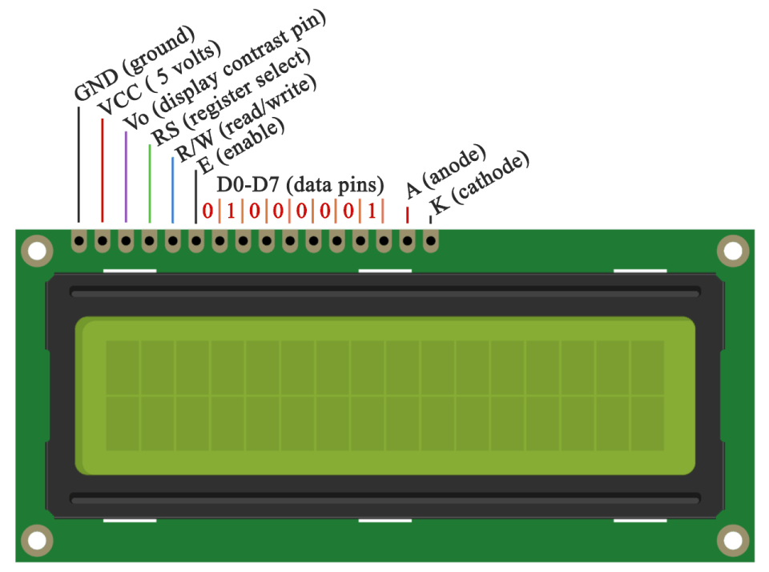
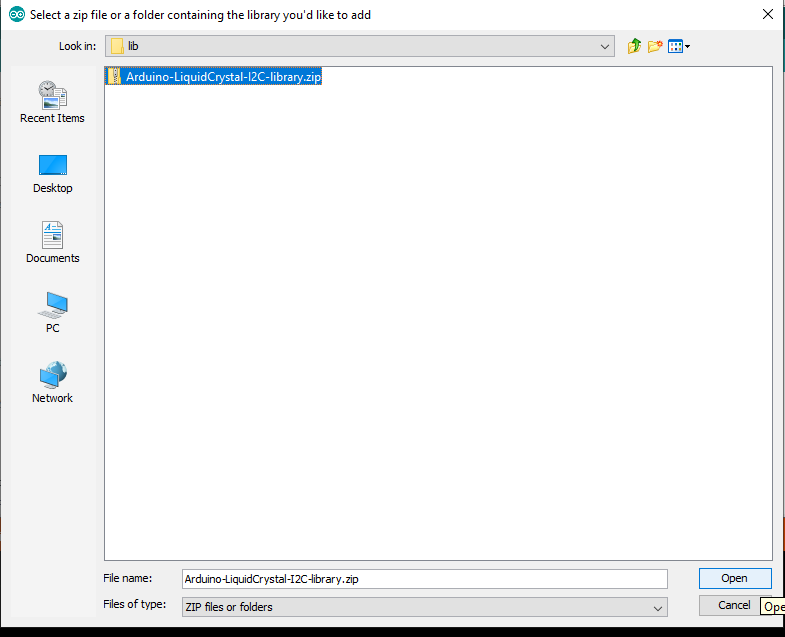

# Digital Scale

In this workhop we will learn how to how to make a digital scale to measure distance.

### Problem Statement 

In order to measure distance from some physical thing we can use scale or measuing tap, but what if we need to need to take continous measurement and analyize the differnce, or we need to make an action depends on the distance like water level, waste level, oil level etc. repetitive continous measurement cost too much human resource. 

### Idea

What if, we have a system that can be continually monitor the level and make actions. 

### Solution

Build a device that can be controled wcontinually monitor the level and make actions like getting notification when a waste bin is full or getting a notification that can be help to prevent flood by monitoring water level..etc

### Prototype Building

* Build a device that Measure distace and displayed on LCD Screen

Here we are using an Arduino as controller and HCSR04 Ultrasonic Module to measure the distance and 16x2 LCD Display to Display the Distance. 

 

### Things we need 

1. Arduino Uno
2. HCSR04 Ultrasonic sensor
3. 16x2 LCD Module
4. 10k ohm potentiometer
5. 220 ohm resistor
6. Jumper Wires
7. Breadboard

#### Ultrasonic Sensor

Ultrasonic sensors work by sending out a sound wave at a frequency above the range of human hearing.  The transducer of the sensor acts as a microphone to receive and send the ultrasonic sound. 

It emits an ultrasound at 40 000 Hz which travels through the air and if there is an object or obstacle on its path It will bounce back to the module. Considering the travel time and the speed of the sound you can calculate the distance.

The HC-SR04 Ultrasonic Module has 4 pins, Ground, VCC, Trig and Echo. The Ground and the VCC pins of the module needs to be connected to the Ground and the 5 volts pins on the Arduino Board respectively and the trig and echo pins to any Digital I/O pin on the Arduino Board.

#### LCD Module
An LCD is an electronic display module which uses liquid crystal to produce a visible image. The 16×2 LCD display is a very basic module commonly used in DIYs and circuits. The 16×2 translates o a display 16 characters per line in 2 such lines. In this LCD each character is displayed in a 5×7 pixel matrix.

#### Pin Description 

### Step 1: Arduino Setup

#### 1.1: Install Arduino IDE

Download the [Arduino IDE](https://www.arduino.cc/en/Main/Software) and install it on your computer.

#### 1.2 walk-through the Arduino Introduction page to learn basics
If you are new to the arduino system, you can learn the [ Arduino basics from here](Arduino-basics/arduino-basics.md) , after reading then go to the next step.

### Step 2: Programming

#### 2.1 Algorithm

#### 2.2 Open Arduino IDE and Start a new Sketch 

#### 2.3 Read then Copy and Paste the Code

### Tesing HCSR04 UltraSonic Module

<pre>

const int trigPin = 9; &nbsp;&nbsp;&#47;&#47; defines Pin 9 as Trigger Pin
const int echoPin = 10; &#47;&#47; define Pin 10 as Echo Pin

&#47;&#47;define Variables
long duration;
int distance;

void setup() {

 &nbsp;pinMode(trigPin, OUTPUT); &#47;&#47; Sets the trigPin as an Output
 &nbsp;pinMode(echoPin, INPUT); &#47;&#47; Sets the echoPin as an Input
 &nbsp;<b>Serial</b>.begin(9600); &nbsp;&nbsp;&nbsp;&nbsp;&#47;&#47; Starts the serial communication

}
void loop() {

 &nbsp;digitalWrite(trigPin, LOW); &nbsp;&nbsp;&nbsp;&nbsp;&#47;&#47; Clears the trigPin
 &nbsp;delayMicroseconds(2); &nbsp;&nbsp;&nbsp;&nbsp;&nbsp;&nbsp;&nbsp;&nbsp;&nbsp;&#47;&#47; wait for 2 micro second
 &nbsp;digitalWrite(trigPin, HIGH); &nbsp;&#47;&#47; Sets the trigPin on HIGH state
 &nbsp;delayMicroseconds(10); &nbsp;&nbsp;&nbsp;&nbsp;&nbsp;&nbsp;&#47;&#47; wait 10 micro second
 &nbsp;digitalWrite(trigPin, LOW); &#47;&#47; Sets the trigPin on LOW state

 &nbsp;duration = pulseIn(echoPin, HIGH); &#47;&#47; Reads the echoPin, returns the sound wave travel time in microseconds

 &nbsp;distance = duration * 0.034 &#47; 2; &nbsp;&#47;&#47; Calculating the distance

 &nbsp;<b>Serial</b>.print(&#34;Distance: &#34;);
 &nbsp;<b>Serial</b>.println(distance); &nbsp;&nbsp;&nbsp;&nbsp;&#47;&#47; Prints the distance on the Serial Monitor

 &nbsp;delay(500); &nbsp;&nbsp;&nbsp;&nbsp;&nbsp;&nbsp;&nbsp;&nbsp;&nbsp;&nbsp;&nbsp;&nbsp;&nbsp;&nbsp;&nbsp;&nbsp;&nbsp;&#47;&#47; wait 500 milli second
}

</pre>

#### 2.4 Compile the code 

You can Compile and verify your code by clicking the **Verify** button on Arduino IDE, this process will check syntax errors. 

after successful compilation you can see **Done Compiling**

#### 2.5 Upload the code into Arduino uno 

After successful compilation we can upload the code into Arduino Uno Devlopment board. for that we need click ***Upload* button.

before upaloading we need to select the devlopment board from the from Arduino IDE **Tools -> Board**  and **Port** from Arduino IDE **Tools -> Port**. 

 
  

here I selected **Arduino Uno** as board and **COM26** as **Port**. 

Then click **Upload**

#### 2.5 Connect the HCSR04 Module to Arduino

We can test the project from halfway without LCD module by using **Serial Monitor** .

After connecting the HCSR04 on arduino connect the USB cable and Open **Serial Monitor** .

We can see the distance measured from the Ultrasonic sensor from the Serial Monitor Window

### Tesing LCD Module

Here we are using LCD Module with **12C addons** for I2C Communication , which will only need two wires for communication, in other way we need to use 14 pins. 

Since the I2C is a addon we need  to insert the library on Arduino IDE first. For that first downlaod the [Arduino-LiquidCrystal-I2C-library.zip](src/lib/Arduino-LiquidCrystal-I2C-library.zip), Then click **Sketch -> Include Library -> Add .ZIP Library**

then select the **.Zip** file and click open.

now we successfully added the I2C library. 

#### Uplaod and Compaile Code 

<pre>
#include &lt;Wire.h&gt; 
#include &lt;<b>LiquidCrystal_I2C</b>.h&gt;

&#47;&#47; Set the LCD address to 0x27 for a 16 chars and 2 line display
<b>LiquidCrystal_I2C</b> <b>lcd</b>(0x27, 16, 2);

void setup()
{
&#09;&#47;&#47; initialize the LCD
&#09;<b>lcd</b>.begin();

&#09;&#47;&#47; Turn on the blacklight and print a message.
&#09;<b>lcd</b>.backlight();
&#09;<b>lcd</b>.print(&#34;Hello, world!&#34;);
}

void loop()
{
&#09;<b>lcd</b>.setCursor(0, 1);
 &nbsp;<b>lcd</b>.print(millis() &#47; 1000);
 &nbsp;
}

</pre>

#### Connect LCD Module with Arduino

 Demonstrates the use a 16x2 LCD display.  The I2C LiquidCrystal Module comes with 4-pins and connect them with follwing model.

 * LCD SCL - Arduino SCL
 * LCD SDA - Arduino SDA
 * LCD GND - Arduino GND
 * LCD VCC - Arduino VCC

 This sketch prints "Hello World!" to the LCD
 and shows the time.

 

### Step 3: Combine both HCSR04 and LCD Module

We tested both and now we need to combine the both hardware and progrmmes into one.

#### 3.1: Upload code.

<pre>
#include &lt;Wire.h&gt;
#include &lt;<b>LiquidCrystal_I2C</b>.h&gt;

&#47;&#47; Set the LCD address to 0x27 for a 16 chars and 2 line display
<b>LiquidCrystal_I2C</b> <b>lcd</b>(0x27, 16, 2);

const int trigPin = 9; &nbsp;&nbsp;&#47;&#47; defines Pin 9 as Trigger Pin
const int echoPin = 10; &#47;&#47; define Pin 10 as Echo Pin

&#47;&#47;define Variables
long duration;
int distance;

void setup() {

 &nbsp;pinMode(trigPin, OUTPUT); &#47;&#47; Sets the trigPin as an Output
 &nbsp;pinMode(echoPin, INPUT); &#47;&#47; Sets the echoPin as an Input
 &nbsp;<b>Serial</b>.begin(9600); &nbsp;&nbsp;&nbsp;&nbsp;&#47;&#47; Starts the serial communication

 &nbsp;&#47;&#47; initialize the LCD
 &nbsp;<b>lcd</b>.begin();

 &nbsp;&#47;&#47; Turn on the blacklight and print a message.
 &nbsp;<b>lcd</b>.backlight();
 &nbsp;<b>lcd</b>.print(&#34;Digital Scale-cm&#34;);

}
void loop() {
 &nbsp;<b>lcd</b>.setCursor(0, 0);
 &nbsp;<b>lcd</b>.print(&#34;Digital Scale-cm&#34;);

 &nbsp;digitalWrite(trigPin, LOW); &nbsp;&nbsp;&nbsp;&nbsp;&#47;&#47; Clears the trigPin
 &nbsp;delayMicroseconds(2); &nbsp;&nbsp;&nbsp;&nbsp;&nbsp;&nbsp;&nbsp;&nbsp;&nbsp;&#47;&#47; wait for 2 micro second
 &nbsp;digitalWrite(trigPin, HIGH); &nbsp;&#47;&#47; Sets the trigPin on HIGH state
 &nbsp;delayMicroseconds(10); &nbsp;&nbsp;&nbsp;&nbsp;&nbsp;&nbsp;&#47;&#47; wait 10 micro second
 &nbsp;digitalWrite(trigPin, LOW); &#47;&#47; Sets the trigPin on LOW state

 &nbsp;duration = pulseIn(echoPin, HIGH); &#47;&#47; Reads the echoPin, returns the sound wave travel time in microseconds

 &nbsp;distance = duration * 0.034 &#47; 2; &nbsp;&#47;&#47; Calculating the distance
 &nbsp;&#47;&#47;String dist = distance + &#34;cm&#34; ;
 &nbsp;<b>Serial</b>.print(&#34;Distance: &#34;);
 &nbsp;<b>Serial</b>.println(distance); &nbsp;&nbsp;&nbsp;&nbsp;&#47;&#47; Prints the distance on the Serial Monitor

 &nbsp;<b>lcd</b>.setCursor(0, 1); &nbsp;&nbsp;&nbsp;&nbsp;&nbsp;&nbsp;&nbsp;&nbsp;&nbsp;&#47;&#47;Set cursor to second line
 &nbsp;<b>lcd</b>.print(distance); &nbsp;&nbsp;&nbsp;&nbsp;&nbsp;&nbsp;&nbsp;&nbsp;&nbsp;&#47;&#47; Print distnace on LCD

 &nbsp;delay(500); &nbsp;&nbsp;&nbsp;&nbsp;&nbsp;&nbsp;&nbsp;&nbsp;&nbsp;&nbsp;&nbsp;&nbsp;&nbsp;&nbsp;&nbsp;&nbsp;&nbsp;&#47;&#47; wait 500 milli second

 &nbsp;<b>lcd</b>.clear(); &nbsp;&nbsp;&nbsp;&nbsp;&nbsp;&nbsp;&nbsp;&nbsp;&nbsp;&nbsp;&nbsp;&nbsp;&nbsp;&nbsp;&nbsp;&#47;&#47;Clear the LCD.
}

</pre>

#### Wiring 

#### Final Demo 

#### ToDO

- [ ] Add button and measure only when the button pressed.

- [ ] Add buzzer and trigger when a speacial requirment.

- [ ] Designa and 3D Print Enclosure.

### Thank You, Hope you enjoyed!
Please share your feedback.

