# Digital Thermostat

In this workhop we will learn how to how to make a digital thermostat to measure and display temprature and Humidity. 

### Problem Statement 

In order to measure temprature and Humidity we using online service , but the probel is that, they are getting the data not your place where you searched so value might have difference, we don't know about that. also we can't make action like turing on A/C when temperature is High/Low like that  using data from online services, for this we need absoulte data.
### Idea

What if, we have a system that can be continually monitor and display temprature and Humidity, that can also be used for trigger some actions.

### Solution

Build a device that can be controled continually monitor the temprature and Humidity and make actions like getting notification ike turing on A/C when temperature is High/Low, notification that can be help to refrigerate our food...etc.

### Prototype Building

Build a device that can be display temprature and Humidity also can be make action depends on the temprature and Humidity .

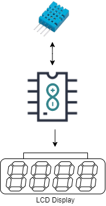

### Things we need

* Arduino Uno
* DHT11- Digital Humidty and Temperature Sensor
* Jumber Wires
* Breadboard

### DHT11

The DHT11 is a basic, ultra low-cost digital temperature and humidity sensor. It uses a capacitive humidity sensor and a thermistor to measure the surrounding air, and spits out a digital signal on the data pin (no analog input pins needed). Its fairly simple to use, but requires careful timing to grab data. The only real downside of this sensor is you can only get new data from it once every 2 seconds, so when using our library, sensor readings can be up to 2 seconds old.

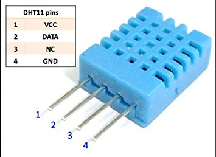

#### LCD Module
An LCD is an electronic display module which uses liquid crystal to produce a visible image. The 16×2 LCD display is a very basic module commonly used in DIYs and circuits. The 16×2 translates o a display 16 characters per line in 2 such lines. In this LCD each character is displayed in a 5×7 pixel matrix.

#### Pin Description 

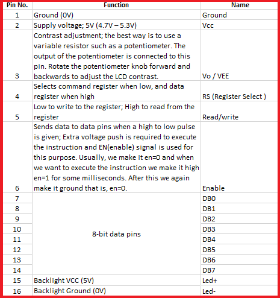

### Step 1: Arduino Setup

#### 1.1: Install Arduino IDE

Download the [Arduino IDE](https://www.arduino.cc/en/Main/Software) and install it on your computer.

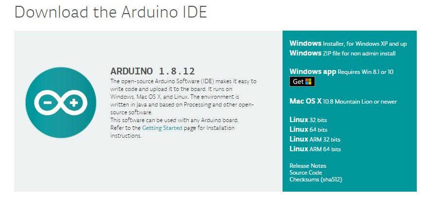

#### 1.2 walk-through the Arduino Introduction page to learn basics
If you are new to the arduino system, you can learn the [ Arduino basics from here](arduino-basics.md) , after reading then go to the next step. 

### Step 2: Programming

#### 2.1 Algorithm

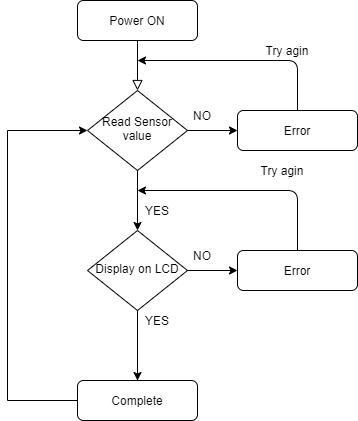

#### 2.2 Open Arduino IDE and Start a new Sketch 

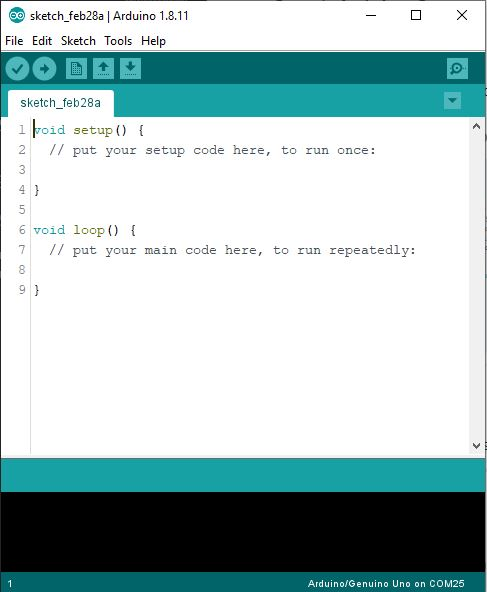

#### 2.3 Read then Copy and Paste the Code

### Tesing DHT11 Sensor Module
Since the DHT11 dones't comes with arduino IDE need to add the library on Arduino IDE first. Open the Library manager from **Sketch -> Include Library- > Manage Libraries**

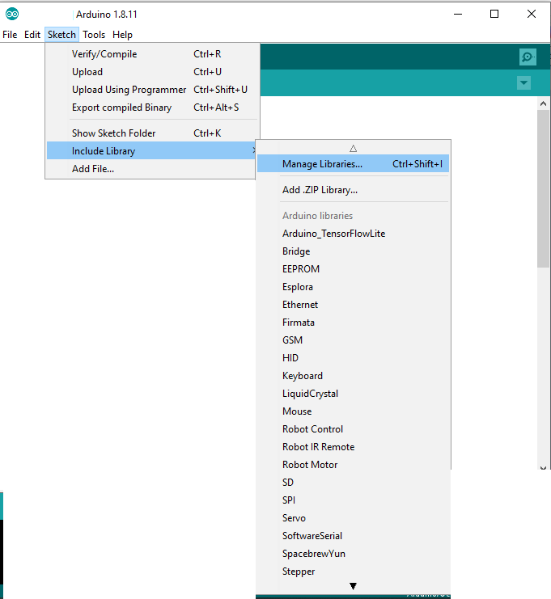

from the follwing window search **DHT11**

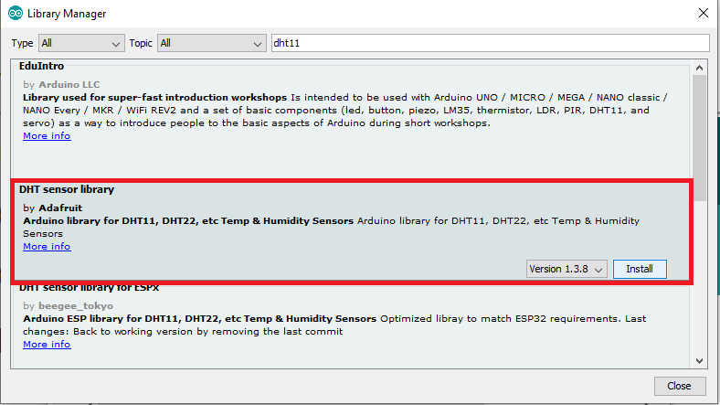

Select the **DHT Sensor library** by Adafruit, and click **Install**.so we successfully added the DHT11 library. 

#### 2.4 Uplaod and Compaile Code

<pre>
#include &#34;DHT.h&#34;

#define DHTPIN 2 &nbsp;&nbsp;&nbsp;&nbsp;&#47;&#47; Digital pin connected to the DHT sensor

#define DHTTYPE DHT11 &nbsp;&nbsp;&#47;&#47; set DHT mode to &nbsp;dht11

<b>DHT</b> dht(DHTPIN, DHTTYPE); &#47;&#47; Initialize DHT sensor with pin and mode.

void setup() {
 &nbsp;<b>Serial</b>.begin(9600);
 &nbsp;dht.begin(); &nbsp;&nbsp;&nbsp;&nbsp;&nbsp;&nbsp;&nbsp;&#47;&#47; Initialize DHT sensor.
}

void loop() {

 &nbsp;delay(2000); &#47;&#47; Wait a few seconds between measurements.

 &nbsp;&#47;&#47; Reading temperature or humidity takes about 250 milliseconds!
 &nbsp;&#47;&#47; Sensor readings may also be up to 2 seconds &#39;old&#39; (its a very slow sensor)
 &nbsp;float humi = dht.readHumidity();
 &nbsp;&#47;&#47; Read temperature as Celsius (the default)
 &nbsp;float temp = dht.readTemperature();
 &nbsp;<b>Serial</b>.print(&#34;Humidity: &#34;);
 &nbsp;<b>Serial</b>.print(humi); &nbsp;&nbsp;&nbsp;&nbsp;&nbsp;&nbsp;&nbsp;&#47;&#47;print humudity
 &nbsp;<b>Serial</b>.print(&#34; &nbsp;&nbsp;&#34;);
 &nbsp;<b>Serial</b>.print(&#34;Temperature: &#34;);
 &nbsp;<b>Serial</b>.print(temp);
 &nbsp;<b>Serial</b>.println(&#34;&#34;);

}

</pre>

#### Connect DHT11 Module with Arduino

Connect the **Data** to Arduino **Digital Pin 2** . 

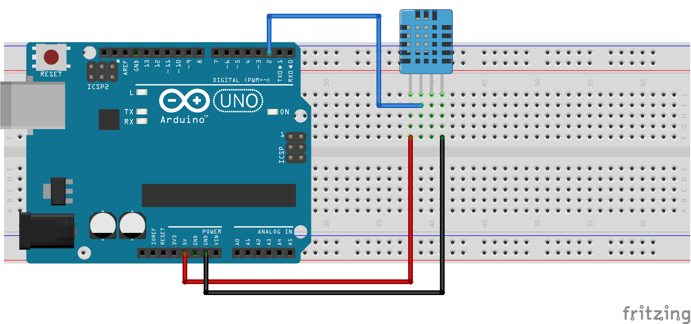

After open the Serial monitor

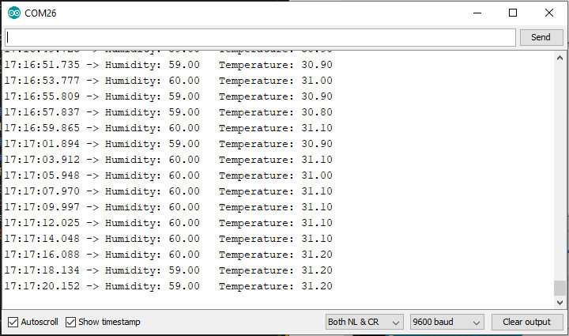

### Tesing LCD Module.

Here we are using LCD Module with **12C addons** for I2C Communication , which will only need two wires for communication, in other way we need to use 14 pins. 

Since the I2C is a addon we need  to insert the library on Arduino IDE first. For that first downlaod the [Arduino-LiquidCrystal-I2C-library.zip](../Digital-Scale/src/lib/Arduino-LiquidCrystal-I2C-library.zip), Then click **Sketch -> Include Library -> Add .ZIP Library**

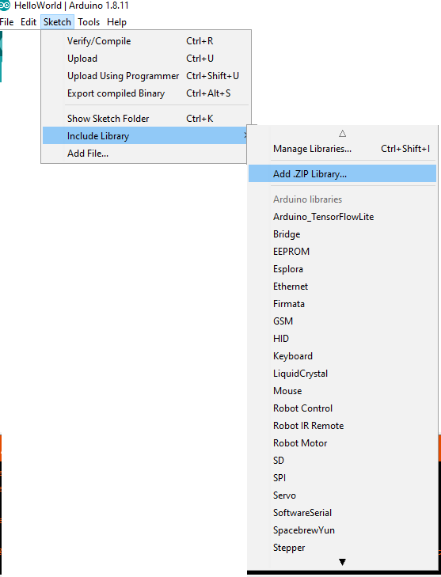

then select the **.Zip** file and click open.
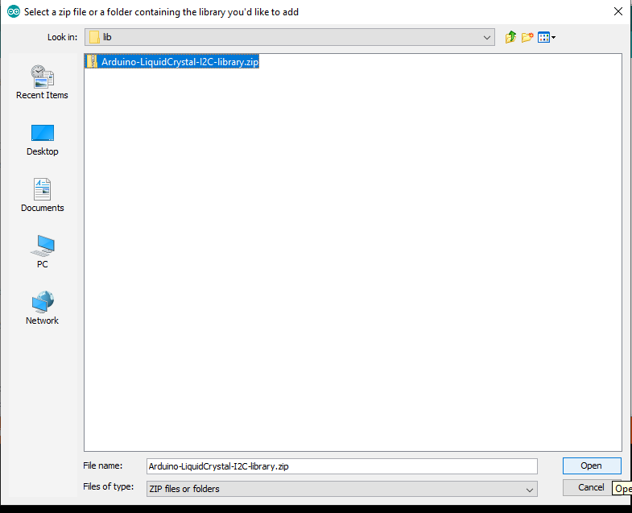

now we successfully added the I2C library. 

#### Uplaod and Compaile Code 

<pre>
#include &lt;Wire.h&gt; 
#include &lt;<b>LiquidCrystal_I2C</b>.h&gt;

&#47;&#47; Set the LCD address to 0x27 for a 16 chars and 2 line display
<b>LiquidCrystal_I2C</b> <b>lcd</b>(0x27, 16, 2);

void setup()
{
&#09;&#47;&#47; initialize the LCD
&#09;<b>lcd</b>.begin();

&#09;&#47;&#47; Turn on the blacklight and print a message.
&#09;<b>lcd</b>.backlight();
&#09;<b>lcd</b>.print(&#34;Hello, world!&#34;);
}

void loop()
{
&#09;<b>lcd</b>.setCursor(0, 1);
 &nbsp;<b>lcd</b>.print(millis() &#47; 1000);
 &nbsp;
}

</pre>

#### Connect LCD Module with Arduino

 Demonstrates the use a 16x2 LCD display.  The I2C LiquidCrystal Module comes with 4-pins and connect them with follwing model.

 * LCD SCL - Arduino SCL
 * LCD SDA - Arduino SDA
 * LCD GND - Arduino GND
 * LCD VCC - Arduino VCC

 This sketch prints "Hello World!" to the LCD
 and shows the time.

 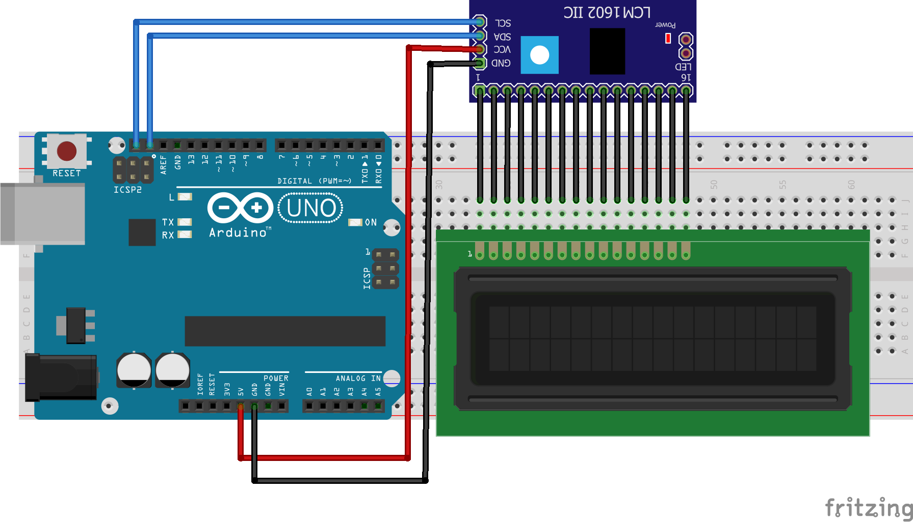

### Step 3: Combine both DHT11 and LCD Module

#### Read code then Upload

<pre>
#include &#34;DHT.h&#34;
#include &lt;Wire.h&gt;
#include &lt;<b>LiquidCrystal_I2C</b>.h&gt;

&#47;&#47; Set the LCD address to 0x27 for a 16 chars and 2 line display
<b>LiquidCrystal_I2C</b> <b>lcd</b>(0x27, 16, 2);

#define DHTPIN 2 &nbsp;&nbsp;&nbsp;&nbsp;&#47;&#47; Digital pin connected to the DHT sensor

#define DHTTYPE DHT11 &nbsp;&nbsp;&#47;&#47; set DHT mode to &nbsp;dht11

<b>DHT</b> dht(DHTPIN, DHTTYPE); &#47;&#47; Initialize DHT sensor with pin and mode.

void setup() {
 &nbsp;<b>Serial</b>.begin(9600);
 &nbsp;dht.begin(); &nbsp;&nbsp;&nbsp;&nbsp;&nbsp;&nbsp;&nbsp;&#47;&#47; Initialize DHT sensor.
 &nbsp;<b>lcd</b>.begin(); &nbsp;&nbsp;&nbsp;&nbsp;&nbsp;&nbsp;&#47;&#47; initialize the LCD
 &nbsp;<b>lcd</b>.backlight(); &nbsp;&#47;&#47; Turn on the blacklight and print a message.

 &nbsp;<b>lcd</b>.setCursor(0, 0);
 &nbsp;<b>lcd</b>.print(&#34;Humi Temp&#34;);

}

void loop() {

 &nbsp;&#47;&#47;delay(2000); &#47;&#47; Wait a few seconds between measurements.

 &nbsp;&#47;&#47; Reading temperature or humidity takes about 250 milliseconds!
 &nbsp;&#47;&#47; Sensor readings may also be up to 2 seconds &#39;old&#39; (its a very slow sensor)
 &nbsp;float humi = dht.readHumidity();
 &nbsp;&#47;&#47; Read temperature as Celsius (the default)
 &nbsp;float temp = dht.readTemperature();

 &nbsp;&nbsp;&nbsp;<b>Serial</b>.print(&#34;Humidity: &#34;);
 &nbsp;&nbsp;&nbsp;<b>Serial</b>.print(humi);
 &nbsp;&nbsp;&nbsp;<b>Serial</b>.print(&#34; &nbsp;&nbsp;&#34;);
 &nbsp;&nbsp;&nbsp;<b>Serial</b>.print(&#34;Temperature: &#34;);
 &nbsp;&nbsp;&nbsp;<b>Serial</b>.print(temp);
 &nbsp;&nbsp;&nbsp;<b>Serial</b>.println(&#34;&#34;);

 &nbsp;<b>lcd</b>.setCursor(0, 0);
 &nbsp;<b>lcd</b>.print(&#34;Humi(%) &nbsp;Temp(C)&#34;);

 &nbsp;<b>lcd</b>.setCursor(0, 1);
 &nbsp;<b>lcd</b>.print(humi);
 &nbsp;<b>lcd</b>.print(&#34; &nbsp;&nbsp;&nbsp;&#34;);
 &nbsp;<b>lcd</b>.print(temp);
 &nbsp;delay(2000);
 &nbsp;<b>lcd</b>.clear();
}

</pre>

#### Wiring

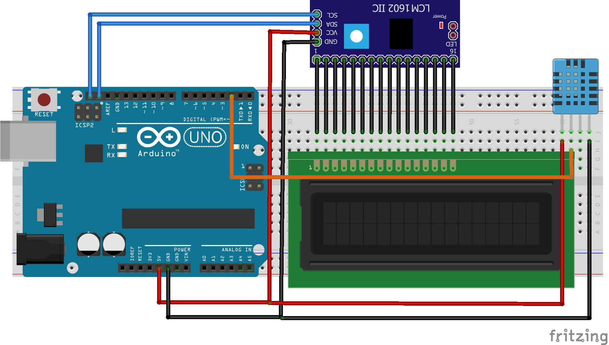

#### Demo

#### ToDO

- [ ] Add buzzer and trigger when a when temprature high.

- [ ] Design and 3D Print an Enclosure.

### Thank You, Hope you enjoyed!
Please share your feedback.
